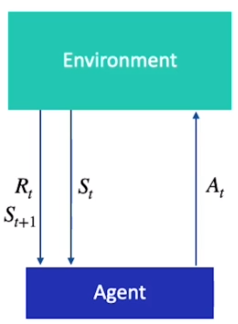
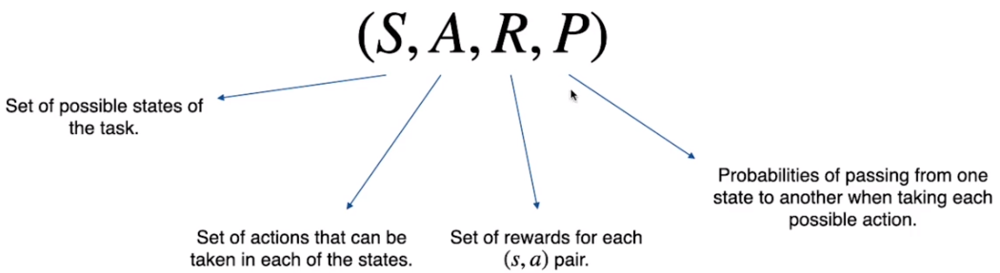

<h1>Markov Decision Process</h1>

Discrete-time Stochastic Control Process
<ul> 
<li> Control: Make decisions to achieve the goals of the task
<li> Stochastic: Agent's action only **partially** affects the evolution of the task
<li> Discrete-time: time progresses in finite intervals
</ul> 

||
|:--:|
|*Markov Decision Process*|

||
|:--:|
|*MDP Representation*|

MDP has no memory:

$P[s_{t+1}|S_t = s_t] = P[S_{t+1} | S_t = s_t, S_{t-1} = s_{t-1}, ..., S_0 = s_0$

The next state only depends on current state and none of the previous states.

<h2>Types of MDP</h2>

Finite vs. Infinite
<ul>
<li>Finite: States, Actions and Rewards are finite. (Chess)
<li>Infinite: >= 1 of the three is infinite. (Driving Car)
</ul>

Episodic vs. Continuing
<ul>
<li>Episodic: Terminates under certain condition
<li>Continuing: Simply keeps going
</ul>

<h2>Trajectory vs. Episode</h2>

<ul>
<li>Trajectory: Elements that are generated when the agent moves from one state to another

>$\tau = S_0, A_0, R_1,S_1, A_1, R_2,S_2, A_2, R_3$

<li>Episode: Trajectory from initial state of the task to the terminal state

>$\tau = S_0, A_0, R_1,S_1, A_1, R_2,S_2, ..., R_T, S_T$
</ul>

<h2>Reward vs. Return</h2>

<ul>
<li>Reward: Immediate result that our action produces (Note that short-term rewards can worsen long-term results.)

>$R_t$

<li>Return: Sum of rewards that our agent obtains from certain point in time, $t$, until the task is completed, $T$. (The main task is to maximize Return)

>$G_t = R_{t+1} + R_{t+2} + R_{t+3} + \cdots + R_T$
</ul>

<h2>Discount Factor</h2>

Incentivizes the agent to reach goal through the shortest route.

>$G_t = R_{1} + \gamma R_{t+2} + \gamma ^2 R_{t+3} + \cdots + \gamma ^{T-1}R_T$

where $\gamma \in [0,1]$ is the discount factor. Thus, the longer it takes, the less the return.

<h2>Policy</h2>

Takes state as input and decides what action to take (action taken in s):

>$\pi:S \rightarrow A$

Probability of Action $a$ in State $s$:
> $\pi(a|s)$

<h3>Deterministic Policy</h3>

Get only one action

> $\pi(s) = a_1$ 

<h3>Stochastic Policy</h3>

Get probability for each action.

> $\pi(s) = [p(a_1),p(a_2),p(a_3), \cdots, p(a_n) ] = [0.3, 0.2, 0.5]$

<h3> Optimal Policy</h3>

$\pi_*$ is the policy that chooses that action that maximizes the Return.

<h2> State Value</h2>

$v_\pi(s) = E[G_t|S_t = s]$

where $v_\pi(s) = E[R_{t+1} + \gamma R_{t+2}  + \cdots + \gamma R^{T-t-1}|S_t = s]$ following policy $\pi$.

<h2> State-Action Value</h2>

$q_\pi(s, a) = E[G_t|S_t = s, A_t = a]$

where $q_\pi(s) = E[R_{t+1} + \gamma R_{t+2}  + \cdots + \gamma R^{T-t-1}|S_t = s, A_t = a]$ following policy $\pi$.

<h2> Bellman Equations</h2>

<h3> State Value</h3>

$v_\pi(s) = E[G_t|S_t = s]$

$ = E[R_{t+1} + \gamma R_{t+2}  + \cdots + \gamma R^{T-t-1}|S_t = s]$ 

$ = E[R_{1} + \gamma G_{t+2}|S_t = s]$ 

$ = \sum_a \pi(a|s) \sum_{s', r} p(s, r | s, a)[r + \gamma v_\pi(s')]$

following policy $\pi$.

<h3>State-Action Value</h3>

$q_\pi(s, a) = E[G_t|S_t = s, A_t = a]$

$ = E[R_{t+1} + \gamma R_{t+2}  + \cdots + \gamma R^{T-t-1}|S_t = s, A_t = a]$ 

$ = E[R_{1} + \gamma G_{t+2}|S_t = s, A_t = a]$ 

$ = \sum_{s', r} p(s',r|s,a)[r + \gamma \sum_{a'} \pi(a'|s')q_\pi(s', a')]$

following policy $\pi$.

<h2>Solving MDP</h2>

The optimal policy $\pi_*$ is the one that chooses actions that maximizes $v(s)$ or $q(s,a)$:

$v_*(s) \\= E_{\pi_*}[G_t | S_t = s] \\= \max_a \sum_{s', r} p(s', r|s, a)[r + \gamma v_*(s')] $ 

where $\pi_*(s) = \argmax_a \sum_{s',r} p(s', r|s, a)[r + \gamma v_*(s)]$, and 

$q_*(s, a) \\= E_{\pi_*}[G_t | S_t = s, A_t = a]\\ = \sum_{s',r} p(s', r|s, a)[r + \gamma \max_{a'} q_*(s', a')]$

where $\pi_*(s) = \argmax_a q_*(s, a)]$.

